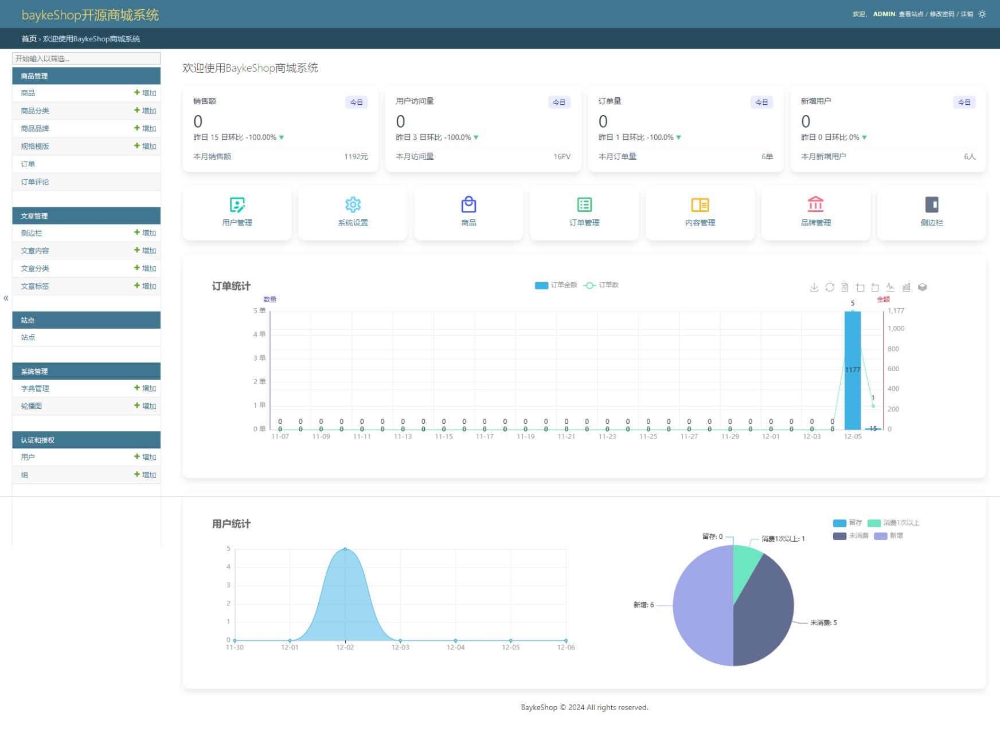

# BaykeShop开源商城系统

## 系统介绍

基于django构建的开源商城模块,可以快速的应用到自己的项目当中，使得自己的项目可以快速的拥有一个商城模块，使用简单，没有过多的依赖第三方包，非常的轻量，只使用了django+pyecharts+pillow+drf等一些基础的模块库，并实现了商城后台所需要的基本数据分析功能图表。

## 系统功能

### 商城模块

1. 商品管理
2. 商品分类
3. 商品品牌
4. 商品规格
5. 商品参数
6. 订单管理
7. 订单评论（可回复评论）

### 内容模块
1. 文章管理
2. 文章分类
3. 文章标签
4. 侧边栏管理

### 系统管理
1. 字典管理
2. 轮播图管理

### 权限管理（django默认）
1. 用户管理
2. 用户组管理

## 商城系统开发实战课程

课程地址：https://www.bilibili.com/cheese/play/ss11391

<a href="https://www.bilibili.com/cheese/play/ss11391">
    
</a>

## 系统截图



## 演示站点

- 前台：http://baykeshop.proae.cn/

- 后台：请按照教程部署，本地访问后台

## 快速开始

```python
# 如果配置了国内源，同步不一定及时，这个命令可能安装不是最新版，可改用第二个命令安装
pip install baykeshop

# 保持最新版本请用PYPI的源
pip install baykeshop -i https://pypi.org/simple --upgrade
```
## 基本配置

1. django项目settings.py中配置

```python
import baykeshop

INSTALLED_APPS = [
    # 'django.contrib.admin',
    'django.contrib.auth',
    'django.contrib.contenttypes',
    'django.contrib.sessions',
    'django.contrib.messages',
    'django.contrib.staticfiles',
    # 需要依赖站点系统
    'django.contrib.sites',
    'rest_framework',
    *baykeshop.INSTALLED_APPS,
]

# 配置站点系统ID（'django.contrib.sites'）
SITE_ID = 1
```
备注：这里我们覆盖了默认的管理站定，默认的管理站点配置需要注释掉或删除，如上所示！
rest_framework是django-rest-framework的依赖包，一般安装本项目时会自动跟随安装，直接引入即可，否则需要自行安装。

2. 配置静态文件
```python
STATIC_URL = 'static/'
STATIC_ROOT = BASE_DIR / 'static'

MEDIA_URL = 'media/'
MEDIA_ROOT = BASE_DIR / 'media'
```

3. 配置图片显示前缀
在项目的settings.py文件中的TEMPLATES配置中，添加如下代码：

```python
'context_processors': [
    ...
    # 添加图片前缀全局变量
    'django.template.context_processors.media',
    ...
],
```

4. 配置数据库

这里我们不做强制配置，直接使用默认的数据库即可，也可以根据自己需要配置数据库，具体请参考Django官方文档。

5. 配置缓存

这里我们不做强制配置，直接使用默认的缓存即可，也可以根据自己需要配置缓存，具体请参考Django官方文档。

## Url配置

在项目的urls.py文件中，添加如下代码：
```python

from django.contrib import admin
from django.urls import path, include
from django.conf import settings
from django.conf.urls.static import static


urlpatterns = [
    # django admin
    path('admin/', admin.site.urls),
    # baykeshop 路由
    path('', include('baykeshop.urls')),
    # 开发时媒体文件
    *static(settings.MEDIA_URL, document_root=settings.MEDIA_ROOT),
    # 开发时静态文件
    *static(settings.STATIC_URL, document_root=settings.STATIC_ROOT)
]
```
注意：这里我们添加了静态文件和媒体文件的配置，是为了方便开发时调试，实际生产环境可以删除。

## 终端命令

最好在虚拟环境中运行...

```shell
# 生成迁移表
python manage.py makemigrations
# 执行迁移表
python manage.py migrate
# 创建超级用户
python manage.py createsuperuser
# 初始化项目必要配置
python manage.py init
# 启动项目
python manage.py runserver
```
配置完成后，即可访问！

# 源码运行

直接克隆源码到本地，本项目源码采用uv开发，具体开发工具使用请参考官方文档！

地址：https://docs.astral.sh/uv/

运行步骤：
```
uv sync
cd project

# 生成迁移表
uv run python manage.py makemigrations
# 执行迁移表
uv run python manage.py migrate
# 创建超级用户
uv run python manage.py createsuperuser
# 初始化项目必要配置
uv run python manage.py init
# 启动项目
uv run python manage.py runserver
```
