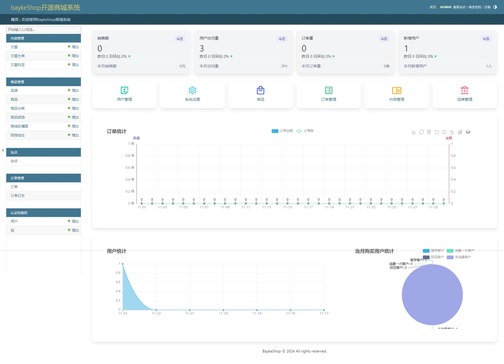

# BaykeShop开源商城系统

## 系统介绍
基于django构建的开源商城模块,可以快速的应用到自己的项目当中，使得自己的项目可以快速的拥有一个商城模块，使用简单，没有过多的依赖第三方包，非常的轻量，只使用了django+pyecharts+pillow等一些基础的模块库，并实现了商城后台所需要的数据分析功能图表。

## 演示站点
前台演示：http://baykeshop.proae.cn/

后台演示：联系作者添加微信（baywanyun）获取访问账号密码！

- 系统截图


## 快速上手

```bash
pip install baykeshop
```

## 基本配置
1. 项目settings.py中配置

```python
INSTALLED_APPS = [
    ...
    'django.contrib.sites',
    'django.contrib.sitemaps',
    'baykeshop.apps.core',
    'baykeshop.apps.article',
    'baykeshop.apps.user',
    'baykeshop.apps.shop',
    'baykeshop.apps.order',
]
# 站点ID（别忘记配置）
SITE_ID = 1
```
这里注意需要引入django的sites模块以及sitemaps模块，否则无法使用sitemap功能。

2. 配置静态文件目录
```python
# 静态文件
STATIC_URL = 'static/'
STATIC_ROOT = BASE_DIR / "static"
# 媒体文件
MEDIA_URL = "media/"
MEDIA_ROOT = BASE_DIR / "media"
```

3. 配置数据库

这里我们不做强制配置，直接使用默认的数据库即可，也可以根据自己需要配置数据库，具体请参考Django官方文档。

4. 配置缓存

Django默认使用内存缓存，如果你需要使用其他缓存，可以参考Django官方文档。

5. 配置日志

Django默认使用文件日志，如果你需要使用其他日志，可以参考Django官方文档。

## URL配置
在项目的urls.py文件中，添加如下代码：
```python
from django.contrib import admin
from django.urls import path, include
from django.conf import settings
from django.conf.urls.static import static
from baykeshop.site import admin as bayke_admin

urlpatterns = [
    path('admin/', admin.site.urls),
    # 后台管理
    path('system/', bayke_admin.site.urls),
    # 前台页面
    path('', include('baykeshop.apps.urls')),
    # 开发时媒体文件
    *static(settings.MEDIA_URL, document_root=settings.MEDIA_ROOT),
    # 开发时静态文件
    *static(settings.STATIC_URL, document_root=settings.STATIC_ROOT)
]
```
## 终端执行命令，生成数据库表初始化项目
```python
# 生成迁移表
python manage.py makemigrations
# 执行迁移表
python manage.py migrate
# 创建超级用户
python manage.py createsuperuser
# 初始化项目必要配置
python manage.py init
# 启动项目
python manage.py runserver
```
配置完成后，即可在浏览器中访问项目。

## 注意事项：

后台管理我们自定义AdminSite,因此默认的admin中是无法使用的。

后台访问需要遵循`path('system/', bayke_admin.site.urls),` 的路径。

